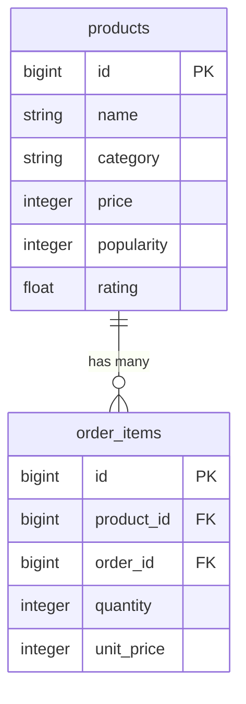
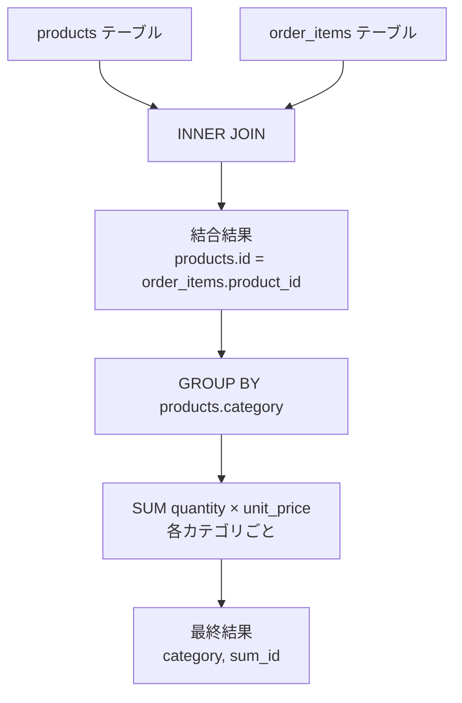
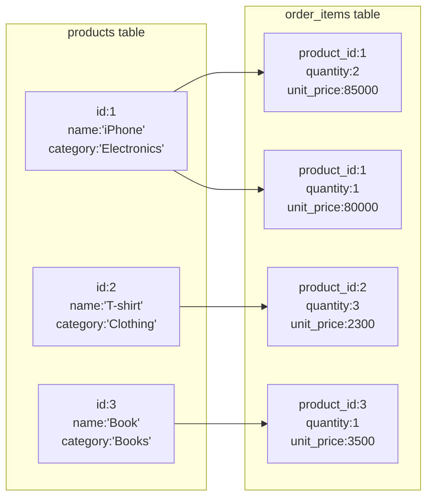
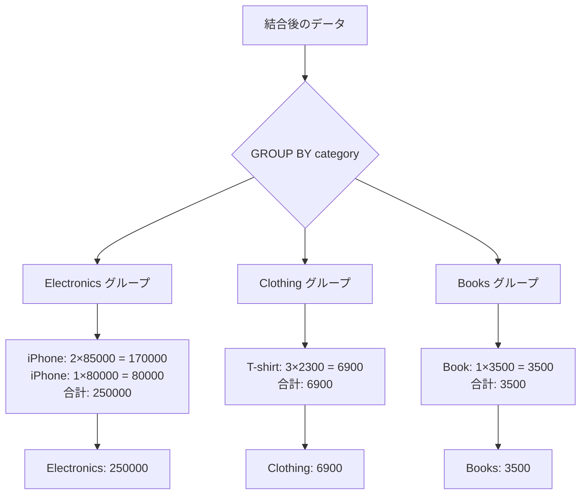
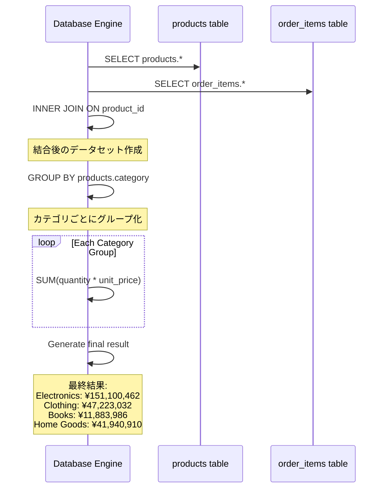
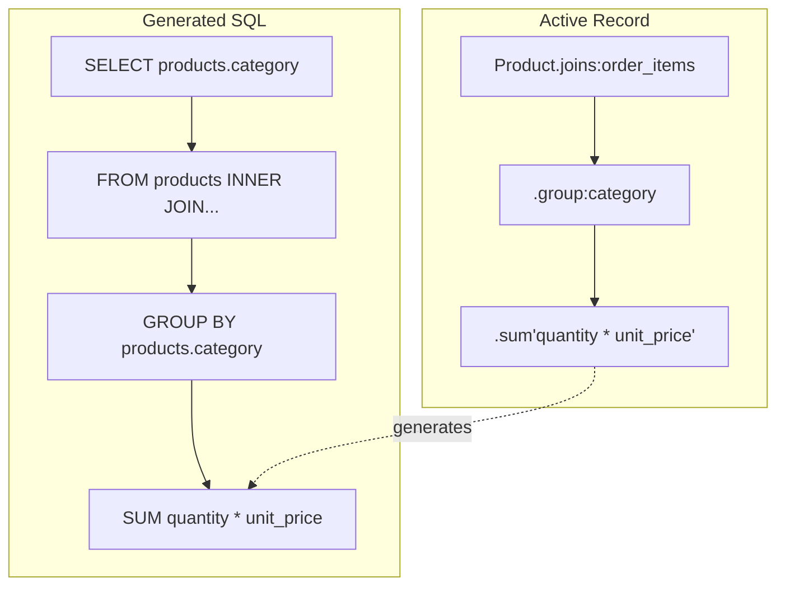
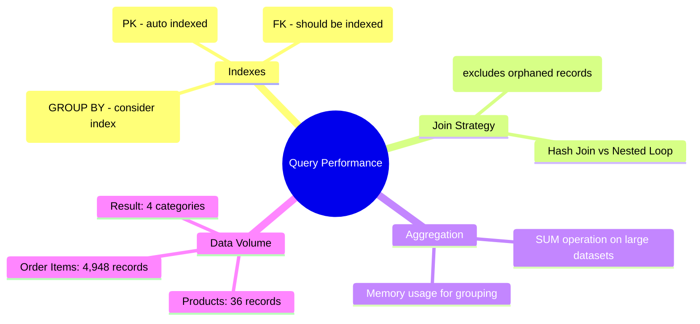
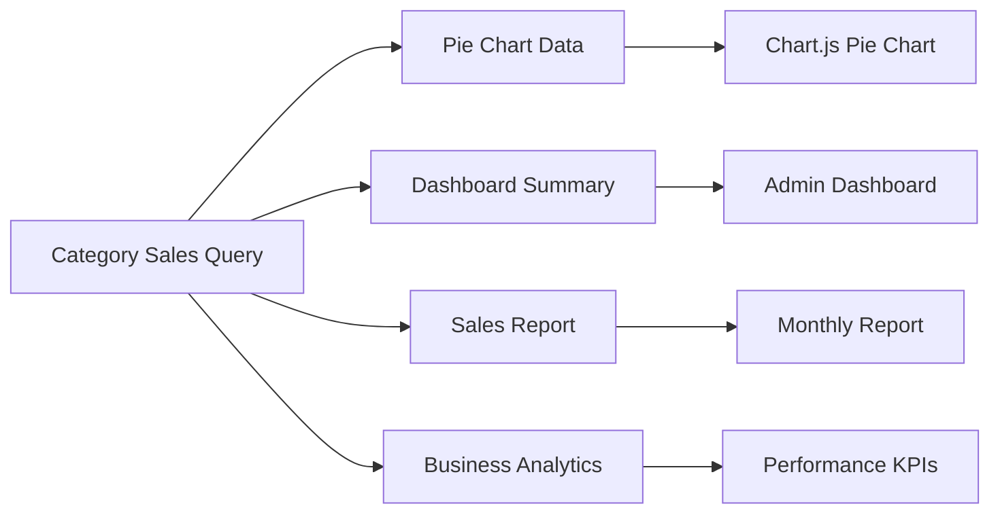
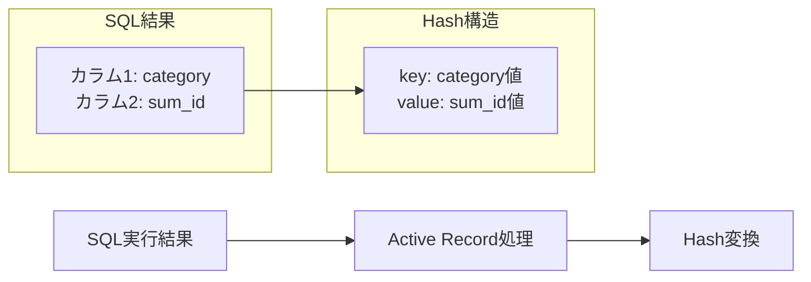

# Category Sales Query Diagram
# カテゴリ別売上クエリ図解

## SQL Query
```sql
SELECT
    products.category,
    SUM(order_items.quantity * order_items.unit_price) AS sum_id
FROM products
INNER JOIN order_items ON order_items.product_id = products.id
GROUP BY products.category
```

## Table Relationships


## Query Processing Flow


## Data Flow Example


## GROUP BY Processing


## Step-by-Step Processing


## Active Record vs Raw SQL


## Performance Considerations


## Use Cases in Application


## SQL Result Structure and Hash Conversion
## SQL結果構造とHash変換

### SELECT句とHash構造の対応
```sql
SELECT
    products.category,                                    -- ← キー (key)
    SUM(order_items.quantity * order_items.unit_price)   -- ← 値 (value)
FROM products
INNER JOIN order_items ON order_items.product_id = products.id
GROUP BY products.category
```

### SQL実行結果からActive Record Hashへの変換

#### SQL実行結果（テーブル形式）
```
| category    | sum_id      |
|-------------|-------------|
| Electronics | 151100462   |
| Clothing    | 47223032    |
| Books       | 11883986    |
| Home Goods  | 41940910    |
```

#### Active RecordのHash変換
```ruby
{
  "Electronics" => 151100462,  # category(key) => sum_id(value)
  "Clothing"    => 47223032,
  "Books"       => 11883986,
  "Home Goods"  => 41940910
}
```

### 一般的なパターン例

#### パターン1: GROUP BY + COUNT
```sql
SELECT category, COUNT(*) FROM products GROUP BY category
```
```ruby
# 結果のHash
{"Electronics" => 10, "Books" => 8, "Clothing" => 12}
```

#### パターン2: GROUP BY + SUM
```sql
SELECT category, SUM(price) FROM products GROUP BY category  
```
```ruby
# 結果のHash
{"Electronics" => 500000, "Books" => 30000, "Clothing" => 80000}
```

#### パターン3: GROUP BY + AVG
```sql
SELECT category, AVG(rating) FROM products GROUP BY category
```
```ruby
# 結果のHash
{"Electronics" => 4.5, "Books" => 4.6, "Clothing" => 4.2}
```

### Hash変換の仕組み


### 重要なポイント

1. **SELECT句の順序**: 最初のカラムが**キー**、2番目のカラムが**値**
2. **GROUP BY**: キーになるカラムでグループ化
3. **集計関数**: 値になる部分（SUM, COUNT, AVG等）
4. **Active Record**: 自動的にHashに変換

### 確認方法
```ruby
# 実際の変換確認
result = Product.joins(:order_items)
                .group(:category)
                .sum('order_items.quantity * order_items.unit_price')

puts result.class    # => Hash
puts result.keys     # => ["Electronics", "Clothing", "Books", "Home Goods"]  
puts result.values   # => [151100462, 47223032, 11883986, 41940910]

# Hash操作例
result.each do |category, sales|
  puts "#{category}: ¥#{sales}"
end
```