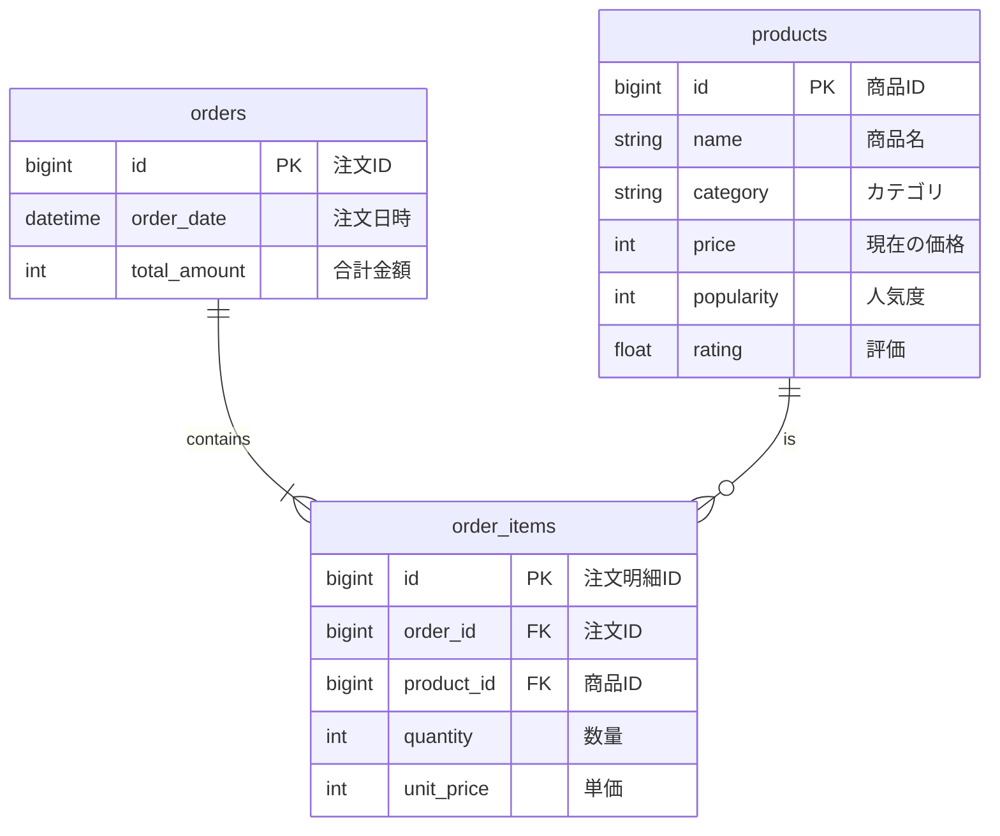

# Database Design
# データベース設計

---

## 1. ER Diagram (Entity-Relationship Diagram)
## 1. ER図

This diagram shows the relationship between the tables in the database. An order can have multiple items, and each item corresponds to a product.

この図は、データベース内のテーブル間の関係を示しています。1つの注文は複数の明細を持つことができ、各明細は1つの商品に対応します。

*   `PK`: Primary Key (主キー)
*   `FK`: Foreign Key (外部キー)

## 2. Table Definitions
## 2. テーブル定義

### 2.1. `products` table
### 2.1. `products` テーブル

(変更なし) This table stores information about the products.
(No changes) このテーブルは商品に関する情報を保存します。

| カラム名 | Railsの型 | SQLの型 | 制約 | 説明 |
| :--- | :--- | :--- | :--- | :--- |
| `id` | `bigint` | `BIGINT` | 主キー | 商品の一意な識別子。 |
| `name` | `string` | `VARCHAR` | Not Null | 商品名。 |
| `category` | `string` | `VARCHAR` | Not Null | 商品のカテゴリ。 |
| `price` | `integer` | `INTEGER` | Not Null | 商品の**現在の**定価。 |
| `popularity` | `integer` | `INTEGER` | | 商品の人気度スコア。 |
| `rating` | `float` | `FLOAT` | | 商品の評価。 |
| `created_at` | `datetime` | `TIMESTAMP` | Not Null | 作成時のタイムスタンプ。 |
| `updated_at` | `datetime` | `TIMESTAMP` | Not Null | 最終更新時のタイムスタンプ。 |

### 2.2. `orders` table (New)
### 2.2. `orders` テーブル (新規)

This table stores information about a single order transaction (the "shopping cart").
このテーブルは、一回の注文取引（「買い物かご」）の情報を保存します。

| カラム名 | Railsの型 | SQLの型 | 制約 | 説明 |
| :--- | :--- | :--- | :--- | :--- |
| `id` | `bigint` | `BIGINT` | 主キー | 注文の一意な識別子。 |
| `order_date` | `datetime` | `TIMESTAMP` | Not Null | 注文が確定した日時。 |
| `total_amount`| `integer` | `INTEGER` | Not Null | この注文の合計金額。 |
| `created_at` | `datetime` | `TIMESTAMP` | Not Null | 作成時のタイムスタンプ。 |
| `updated_at` | `datetime` | `TIMESTAMP` | Not Null | 最終更新時のタイムスタンプ。 |

### 2.3. `order_items` table (New)
### 2.3. `order_items` テーブル (新規)

This table stores the details of each product within an order.
このテーブルは、各注文に含まれる商品の明細を保存します。

| カラム名 | Railsの型 | SQLの型 | 制約 | 説明 |
| :--- | :--- | :--- | :--- | :--- |
| `id` | `bigint` | `BIGINT` | 主キー | 注文明細の一意な識別子。 |
| `order_id` | `references`| `BIGINT` | 外部キー (`orders.id`) | この明細が属する注文のID。 |
| `product_id` | `references`| `BIGINT` | 外部キー (`products.id`) | 購入された商品のID。 |
| `quantity` | `integer` | `INTEGER` | Not Null | 購入された数量。 |
| `unit_price` | `integer` | `INTEGER` | Not Null | **購入時点での**商品の単価。 |
| `created_at` | `datetime` | `TIMESTAMP` | Not Null | 作成時のタイムスタンプ。 |
| `updated_at` | `datetime` | `TIMESTAMP` | Not Null | 最終更新時のタイムスタンプ。 |
